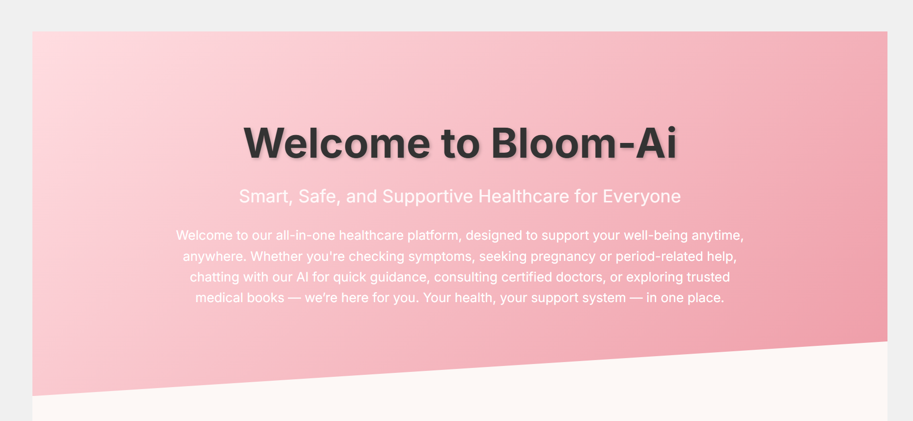
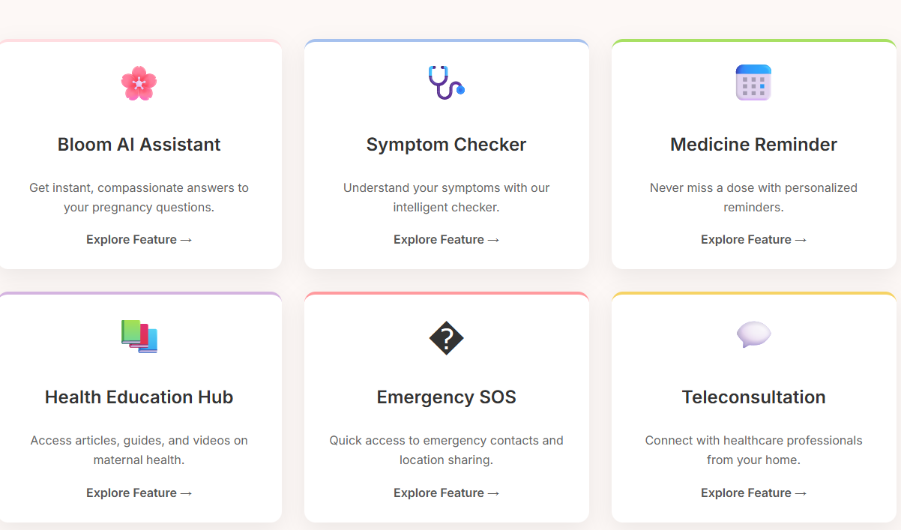
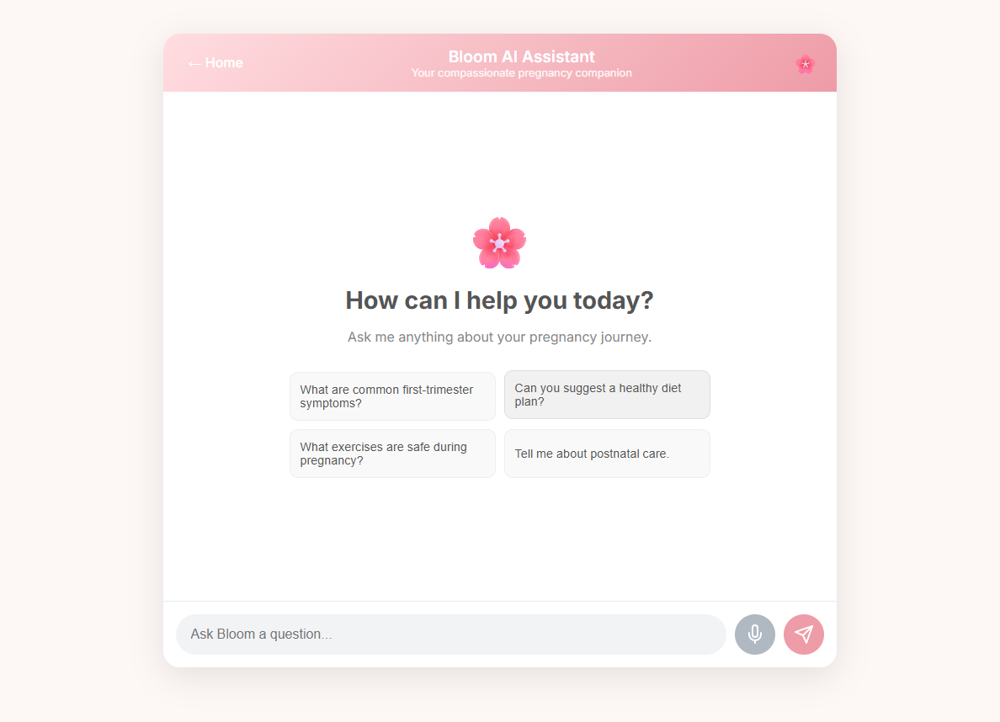

🌸 Bloom Healthcare AI
Bloom is an AI-powered, mobile-first healthcare platform designed to deliver fast, accessible, and supportive medical care, with a focus on maternal health and rural communities.

🚀 Key Features
🤖 Bloom AI Assistant: Get instant, compassionate answers to your pregnancy question.

🩺 AI Symptom Checker: Understand your symptoms with our intelligent, multilingual checker.

📅 Medicine Reminder: Never miss a dose with personalized reminders.

📚 Health Education Hub: Access articles, guides, and videos on maternal health.

🚨 Emergency SOS: One-click alerts with GPS location sharing for rapid response.

💬 Teleconsultation: Connect with healthcare professionals directly from your home.

🌐 Multilingual & Voice-Activated: Accessible to a wider audience through multiple languages and voice commands.

🔗 Offline Access: Critical health information is available even without an internet connection.

📸 Screenshots
Here is where you can add screenshots of your application. You can take screenshots of the different pages and features and add them here.

Home Page
Bloom AI Assistant
Symptom Checker
Teleconsultation Booking
🛠 Tech Stack
Category	Technology
Frontend	React.js, Vite, React Router, Axios
Backend	Node.js, Express.js
AI & NLP	Google Generative AI (Gemini), OpenRouter API
Styling	CSS, Emotion, Material-UI (MUI)
Real-time	Twilio API for SMS alerts

Export to Sheets
📦 Installation & Setup
To get a local copy up and running, follow these simple steps.

Prerequisites
Node.js (v18 or higher)

npm

Installation
Clone the repository:

Bash

git clone https://github.com/Akashraj2106/Bloom_Healthcare_AI.git
cd Bloom_Healthcare_AI
Install frontend dependencies:

Bash

npm install
Install backend dependencies:

Bash

cd backend
npm install
Set up environment variables:

Create a .env file inside the backend/config/ directory and add the following variables:

Code snippet

MONGO_URI=your_mongodb_connection_string
JWT_SECRET=your_jwt_secret
Run the application:

Start the backend server:

Bash

# From the backend directory
npm start
Start the frontend development server:

Bash

# From the root project directory
npm run dev
The application should now be running on http://localhost:5173
